# Palms and Peaks Resort website

Palms and Peaks resort is a website which is responsive website which allows visitors to view on a range of devices from Mobile to Large computer monitors.

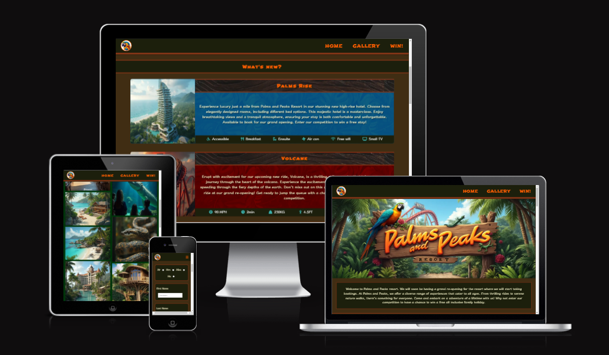

[View Palms and Peaks on GitHub Pages](https://nchrist89.github.io/Palms-Peaks-P1/)

## Introduction

This has been my first website build. I was not exactly sure what to build for my website. It took a few days to decide and within that time I had the idea to build a website for a theme park but I had too many different ideas and thought a resort would allow me to include what I had envisioned which was a tropical amusement park with accommodation, rides and many fun activities to do. I had also been looking into holidays as I have had to combat some problems personally this year so building this website felt like a getaway which I need.

when thinking of a Tropical resort I had in mind the colour and feel to what has become the outcome of the project. it is what I had wanted to create. If you know of Crash Bandicoot, inspiration from Crash Cove and the first couple tropical levels gave me some ideas on the feel and vibrancy I wanted.

Unfortunately, mid-way through the project I had to stop the build due to medical issues which have affected me since early June, being in hospital in July. I have not been entirely back to full health since and so I had to slim down the project after taking time out. I am still happy with the project. I wanted to build a purely HTML / CSS website and use flexbox as I wanted to learn that at a much deaper level before moving on to other technology such as bootstrap which I understand will be used in another upcoming project. There have been many stressful times on the build and lots of lessons have been learnt. I have had so much fun building this project, and along the way I have learnt some improvements I can implement next time.  Mainly to do with planning, I would like to fully plan out the code and structure of the code I will most likely need first.

Anyways, I hope you have fun checking out my first website!

## CONTENTS
- [Palms and Peaks Resort website](#palms-and-peaks-resort-website)
  - [Introduction](#introduction)
  - [CONTENTS](#contents)
  - [User Experience (UX)](#user-experience-ux)
    - [User Stories](#user-stories)
  - [Design](#design)
    - [Colour Scheme](#colour-scheme)
    - [Typography](#typography)
    - [Imagery](#imagery)
    - [Wireframes](#wireframes)
    - [Features](#features)
    - [Accessibility](#accessibility)
  - [Technologies Used](#technologies-used)
    - [Languages Used](#languages-used)
    - [Frameworks, Libraries \& Programs Used](#frameworks-libraries--programs-used)
  - [Deployment and local development](#deployment-and-local-development)
    - [Deployment](#deployment)
    - [Local Development](#local-development)
      - [How to Fork](#how-to-fork)
      - [How to Clone](#how-to-clone)
  - [Testing](#testing)
    - [W3C Validator](#w3c-validator)
    - [Solved Bugs](#solved-bugs)
    - [Known Bugs](#known-bugs)
    - [Testing User Stories](#testing-user-stories)
    - [Lighthouse](#lighthouse)
      - [Index Page](#index-page)
      - [Gallery Page](#gallery-page)
      - [Win Page](#win-page)
      - [Success Page](#success-page)
    - [Full Testing](#full-testing)
  - [Credits](#credits)
    - [Code used](#code-used)
    - [Content](#content)
    - [Media](#media)
      - [Images](#images)
    - [Acknowledgements](#acknowledgements)
___
## User Experience (UX)

**Initial Planning**

When deciding that I would build a resort website with attractions. My scope for the project was very large so the final result wasn't what I had originally planned but I believe it's still good as it stands as a website to gain interest in the reopening of the resort.

Due to the wildlife sanctuary's recent expansion in the past decade, The owner has decided to make some major improvements overall to the resort as a whole. Some of the features already seen in the resort have been improved upon while many new features have been added to the resort. The website is designed to give potential visitors a sneak peek at what they can look forward to at the reopening and a chance to win a family holiday when it reopens in early 2025. It is not a full website but as a poster of sort to get attention.

**Key information for the site**

* What can I look forward to do at the resort re-opening.
* What is a new addition to the resort which I can look forward to.
* Provides descriptive information about the resort and the features available.
* Where can I subscribe to a newsletter to the resort.

### User Stories

**Client Goals**

* To get interest from users and potential visitors for the re-opening of the resort.
* For the site to be viewed on a range of different devices.
* Be able to see what the resort is and what is available to do within the resort.
* For users to be able to contact the resort if needed for further information.
* To see anything new which the resort has recently added as a new feature.
* For users to be able to take part in a competition to win a holiday to the resort.

**First Time Visitor Goals**

* I want to see what I can look forward to at the re-opening of the resort.
* I want to be able to navigate the site easily and find what I am looking for.
* I want to see what new features have been added to the resort.
* I want to be able to see pictures of the resort, the animals and the rides available in the resort.
* I want to be able to find out how I can contact the resort and where it is located.
* I want to find out about the resort itself and why I should be excited.

**Returning visitor goals**

* I would like to see if there has been anything recently added to the resort’s new features prior to the reopening.
* I would like to contact the resort and pre-plan a visit to the resort.
* After checking availability with family and friends I would like to enter the competition.

## Design

### Colour Scheme

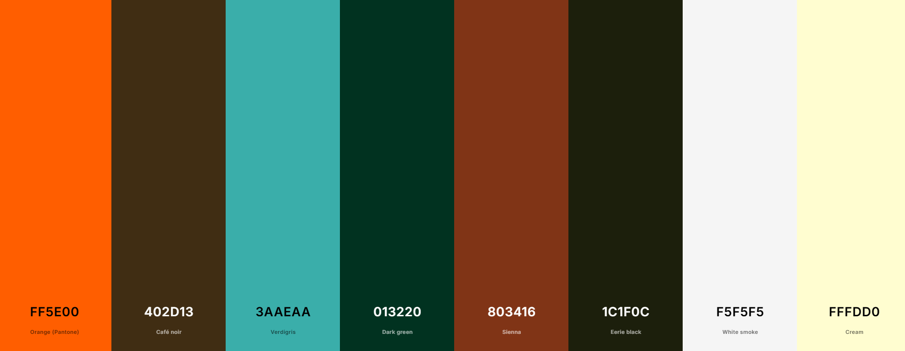

This is the colour palette I have used in the website. They were taken from the original image I was going to use as the main banner for the homepage. The colour palette was created using the [Image Colour Picker](https://imagecolorpicker.com/) website. The website provided different names for the colours so they are Tropical Themed in my website variable names but the hex codes remain the same.

The picture used to pick out my hex codes used:

   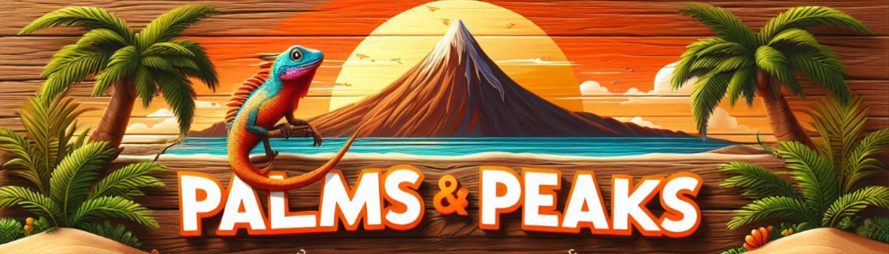

### Typography

When choosing the font I wanted it to feel quirky and tropical and fun. Shojumaru was what I had visioned and straight away I knew it was the font I would use for headings. Klee One was one of many chosen but won the position to take the body text spot for my website.

Google Fonts has been used for the following fonts:

* Shojumaru is used for all major headings on the website and the navigation bar links. It is a chop suey style font.

* Klee One has been used as the body text for the website. It is a script font.

### Imagery

All images on the homepage of the website have been generated using [Prome AI](https://www.promeai.pro/ai-image-generation) website. Images from the Gallery are from various AI image tools Microsoft Designer, fal.ai, aitubo.ai.

Images for styling purposes such as the navigation bar wooden pattern and heading backgrounds was taken from google images.

### Wireframes

Wireframes was used prior to building the website but due to medical issues the project was cut down and therefore the wireframe for this doesn't quite match up but it gives an idea of what I originally wanted planned for the website.

[Desktop Wireframes](docs/readme-docs/readme-images/wireframes-desktop.png)

[Tablet Wireframes](docs/readme-docs/readme-images/wireframes-tablet.png)

[Mobile Wireframes](docs/readme-docs/readme-images/wireframes-mobile.png)

### Features

The website is comprised of four pages. Three of them are accessible from the navigation menu (home page, gallery and Win pages). The fourth page is a success page which is shown once the user submits the competition form on the win page.

* All pages on the website have:

  * A responsive navigation bar at the top of the page which allows users to navigate through the website. At the top left of the navigation bar is a logo of a parrot which is circular. Think of this as the mascot for the website which also doubles as a home button when clicked. When viewing the website on mobile devices the navigation bar links collapse into a burger toggler which when clicked opens the navigation links in a sidebar.

  * A footer which contains social media links which all open in a new tab when visited. Icons were used without titles as they are universally recognised.

* Home page.

  * A banner image showing the sign of Palms and Peaks Resort. This explains straight away to users and what to expect from the website.

   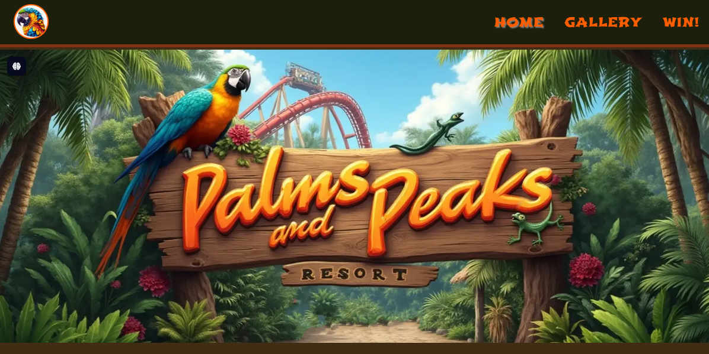

  * A welcome note section to welcome new users to the website.

   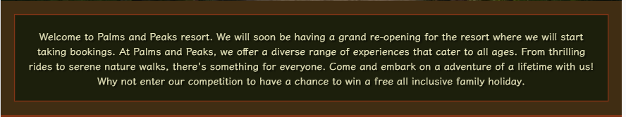

  * A new features section which shows the user what new and upcoming features will be available to look forward to.

   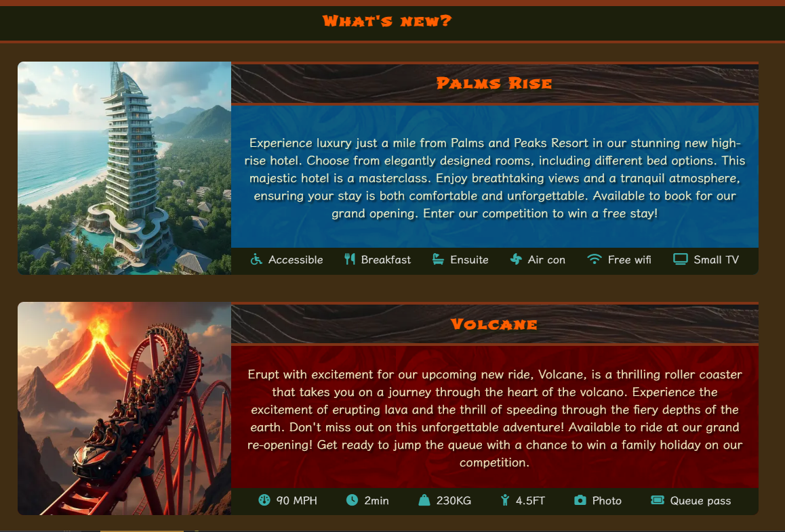

  * An about us section which includes some information about the resort and its history.

   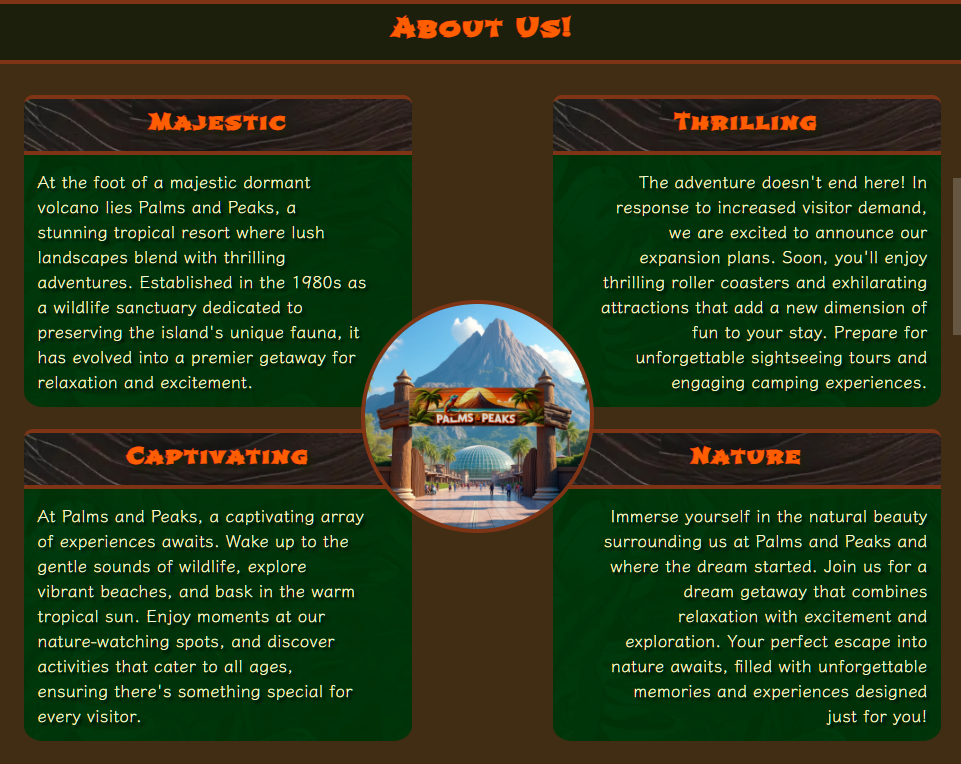

  * A section which shows an outline of what the resort has to offer visitors. Originally in my website creation these were supposed to link to their own full sections which were on other pages of the website. (Animals, Exploration, Stays, Shops, Rides, Camping, Beach Bars, Activities)

   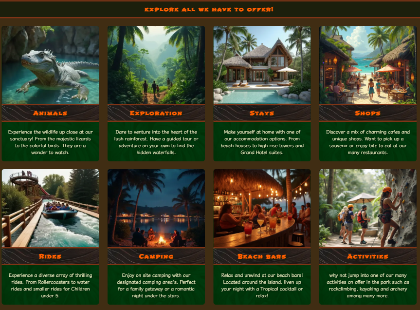

  * A map section which shows the geographical location of the fictional resort which was found using google maps.

   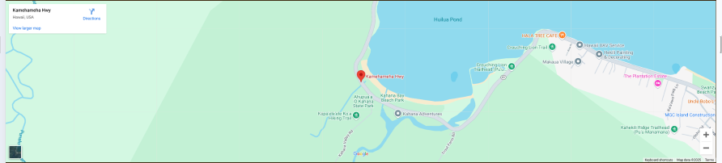

* Gallery Page.

  * The gallery page shows a selection of images which show the resort, some animals and the park itself. All of the images were designed using AI. Some of which were to be used in the final project and I didn't want to not use them somewhere. Many hours went into getting many images the way I wanted.

* Win page.

  * The win page has a form which can be completed by the user for a chance to win a family holiday.

* Success Page.

  * Provides the user a success message for submitting the competition form on the win page.

### Accessibility

I have throughout the project ensured that the website has been accessibility friendly as possible. This has been achieved by:

* Using semantic HTML
* Using descriptive alt attributes on images on the site.
* Ensuring that there is sufficient colour contrast throughout the website.
* Ensuring that menu items are accessible by marking the current page as active for screen readers.

## Technologies Used

### Languages Used

HTML and CSS were used to create this website.

### Frameworks, Libraries & Programs Used

Balsamiq - Used to create Wireframes.

Git - For version control.

Visual Studio Code - For writing, saving and storing the files used for the website.

Google Fonts - To import fonts used on the website.

Font Awesome - For the iconography used on the website.

Google Dev Tools - To troubleshoot and test all features on the website. Check and resolve issues with the responsivity on the website across devices.

Google maps - For the location of the fictional resort on the home page.

[Prome AI](https://www.promeai.pro/ai-image-generation) - Used for generating the images used in the final project.

[Tiny Wow (highly recommend)](https://tinywow.com/) - To batch resize multiple images and to convert to WebP format for reduced file size.

[Image Colour Picker](https://imagecolorpicker.com/user/palettes) - Used for generating the palette which has been used throughout the project. The website also generated the names for the colours which are also referred to as their variable root names in the project.

[Gimp](https://www.gimp.org/) - Used for modifying and editing images used on the website.

[Favicon.io](https://favicon.io/) - To create favicon.

[Am I responsive](http://ami.responsivedesign.is/) - To show the website image across a range of devices.

## Deployment and local development

### Deployment

Github Pages was used to deploy the live website. The instructions to achieve this are below:

1. Log in (or sign up) to Github.
2. Find the repository for this project, Palms-Peaks-P1
3. Click on the Settings link.
4. Click on the Pages link in the left hand side navigation bar.
5. In the Source section, choose main from the drop down and select branch menu. Select Root from the drop down select folder menu.
6. Click Save. Your live Github Pages site is now deployed at the URL shown.

### Local Development

#### How to Fork

To fork the Palms-Peaks-P1 repository:

1. Log in (or sign up) to Github.
2. Go to the repository for this project, Nchrist89/Palms-Peaks-P1.
3. Click the Fork button in the top right corner.

#### How to Clone

To clone the Palms-Peaks-P1 repository:

1. Log in (or sign up) to Github.
2. Go to the repository for this project, Nchrist89/Palms-Peaks-P1.
3. Click on the Code button, select whether you would like to clone with HTTPS, SSH or GitHub CLI and copy the link shown.
4. Open the terminal in your code editor and change the current working directory to the location you want to use for the cloned directory.
5. Type 'git clone' in the terminal and then paste the link you copied in step 3. Press Enter.

## Testing

Testing has been conducted throughout the entire build of the website. The website was deployed early to ensure that along the way any issues were dealt with prior to adding further features to ensure the build was being maintained and any issues and bugs were fixed. I utilized Chrome developer tools while checking any issues I faced, pinpointing where problems have originated from and resolving them.

### W3C Validator

The W3C validator has been used to validate the HTML on all pages of the website. It has also been used to validate CSS in the style.css file.

* [Index page HTML](docs/readme-docs/readme-images/validation-home.png)
* [Gallery Page HTML](docs/readme-docs/readme-images/validation-Gallery.png)
* [Competition Page HTML](docs/readme-docs/readme-images/validation-win.png)
* [Success Page HTML](docs/readme-docs/readme-images/validation-success.png)
* [Style.css CSS](docs/readme-docs/readme-images/validation-css.png)

### Solved Bugs

1. I had an issue with the home page where the image boxes all had a blank white line beneath them or vertically on the right side causing an issue making them fit correctly. To correct this, I had to look online where I found that many other people had the same issue. To resolve it used they had used various methods. In the end I used the 'display: flex' method which removed the blank white line.

2. There was an issue with the main feature cards I had created on the home page where the images would not fit correctly when they were adapting to other devices responsively. After looking online and through troubleshooting this issue. I ended up playing around with the options I had available where I found that making the width of the image 100% to its container and the height as content-fit this managed to resolve the issue.

   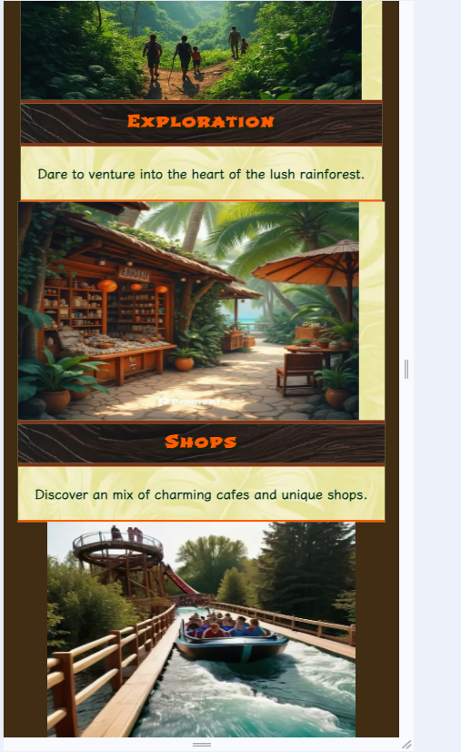

3. Creating the about section for the park caused me quite a headache. The idea came from the love running training to use 4 text boxes around a central image which is circular. I used some of the knowledge from the tutorial video but in the end, it still was not how I wanted it visually.

   After asking ChatGPT and explaining what I wanted, ChatGPT almost supplied code to get it visually correct. After a few hours testing various code supplied from ChatGPT, It was never ideal for what I had in mind. So, I went back to pen and paper and drew out with borders what I desired. whilst also taking some help from the love running code by ensuring the 2 left and right text boxes were housed in their own div, along with testing I was able to figure out how to do it. After countless hours of failure. It seemed through drawing it with pen and paper allowed me to see what I was unable to before and within 30 minutes I had it figured out.

   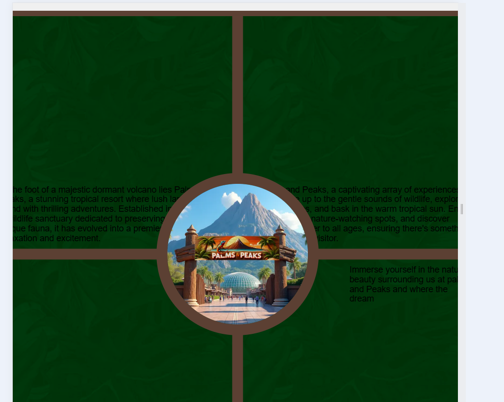
   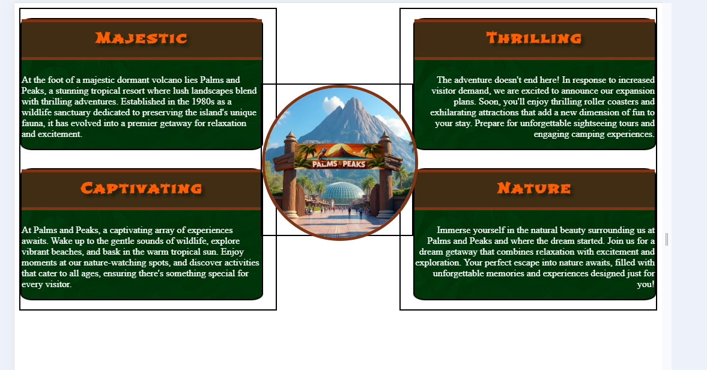

4. The new features boxes also caused me hours of trial and error as I worked through multiple bugs while configuring the layout to shift from column to row when the screen resolution exceeded 992px. These feature boxes was originally designed for a stays.html page which is no longer part of the final project.

   The new feature box design had to show an image of the new feature, and by the side of it all the information about that new feature. The heading, the information and additional features were to show vertically but also stretched across the screen when viewing on a larger screen >992px and to switch to a row direction with flexbox. In order to do this, I had searched the internet but couldn't quite explain how I wanted it to look and after much searching, in the end I thought doing this myself would be a challenge as I knew I could figure it out. Below was the idea which I had in mind.

   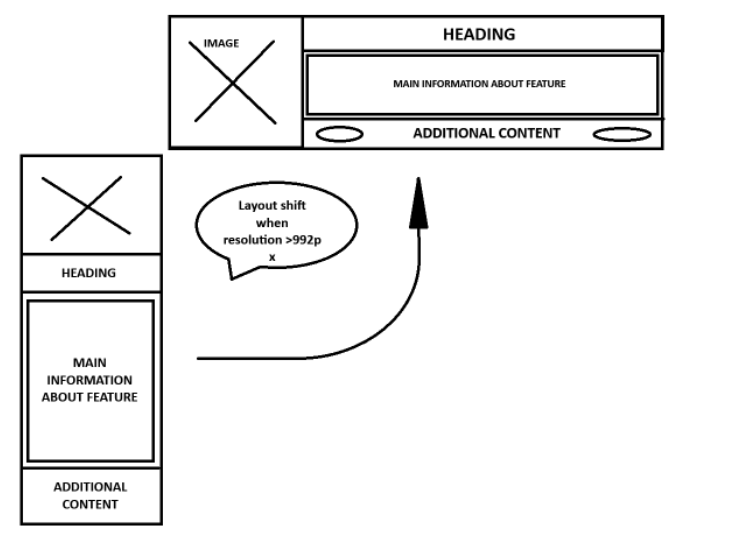

   Mid way through the process of building this section.
   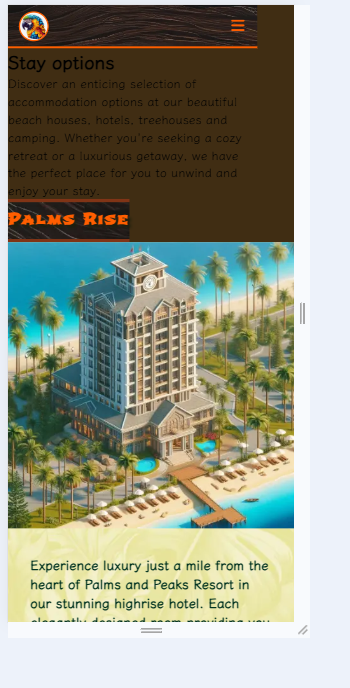
   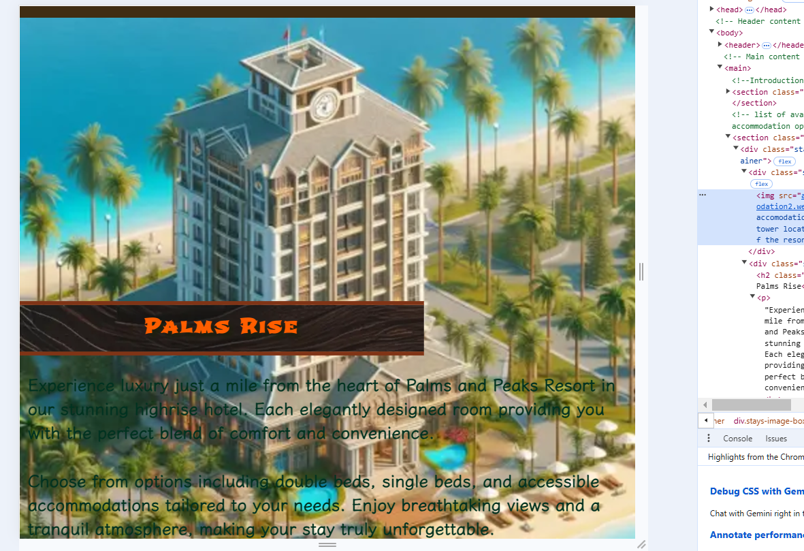

   To resolve this, I branched my repository and used a Training Branch which I would use as a playground to test any new features including this one. After quite a few hours. I managed to have the new feature box how I wanted it visually. Then I had to take it from being horizontal on a large viewing device to mobile and therefore working backwards from what I was originally doing. This then caused further issues when I copied the code over from a styling.css testing stylesheet. It was then back to the playground to retest and find how to move over the code to my final project where it would successfully be responsive. I could write about 15 different bug fixes just on this one feature. in the end the below shows the final result.

   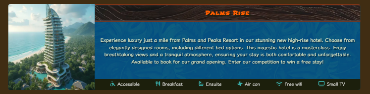

5. There have been many other smaller bugs which I came across during the process of building the website which I could reference here too but they didn't take very long to fix or very little research to find out how to resolve but there have been many more than the 4 I have been able to remember now writing this. Next time I will write anything down I believe is worth adding to my next project readme.

### Known Bugs

I feel like I have done okay with ironing out bugs in the project. After checking over the project fully I am happy I have done the best I can resolving the bugs I have had.

   1. The about section has a minor bug which means that the image box moves slightly when dragging the screen size to make it larger. Unfortunately, due to time constraints I am unable to return to the playground to resolve this issue now and it will have to remain, but I have tried to add media queries to rectify it as best as I can.

### Testing User Stories

* First Time Visitors
  * I want to be able to see from the home page what the resort offers. The home page allows visitors to see an outline of all the major features of the resort and has a brief description of them.

  

  * I want to be able to navigate the site easily and find what I am looking for. All site navigation is through the top navigation bar which is visible on all pages throughout the website. When viewed on a mobile device the navigation bar collapses into a hamburger icon which can be clicked to pull out a sidebar which includes the navigation links.

  
  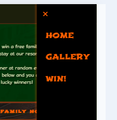

  * I want to be able to see pictures of the resort, the animals, and the rides available in the resort. A gallery has been added to give the resort and animals attention and give the users a feel of the vibrancy and excitement and animals it has housed.

  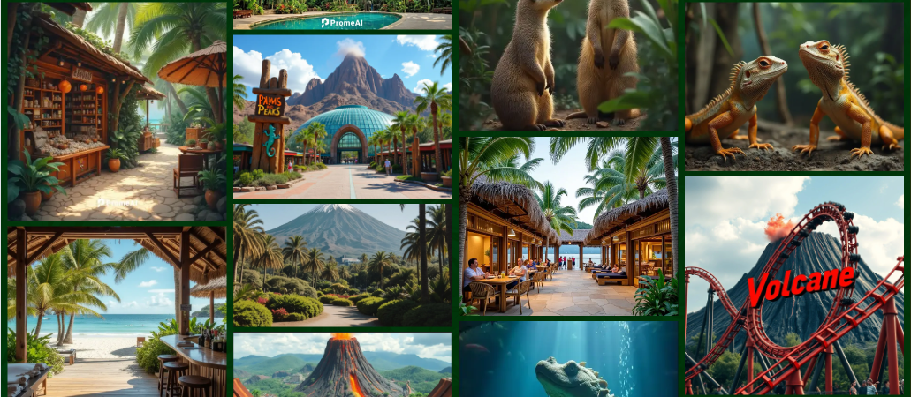

  * I want to be able to find out how I can contact the resort and where it is located. At the bottom of the website users are able to find the contact information in the footer of the page.

  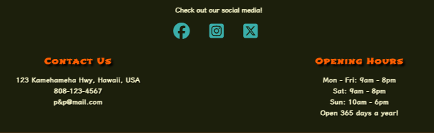

* Returning Visitors
  * I want to  be able to see if there is anything new since my last visit. A new feature section allows visitors to see what has recently been added to the resort and what they can look forward to in the future.

   

  * After checking availability with family and friends I would like to enter the competition. Competition is available through the main navigation to access.

### Lighthouse

I used Lighthouse within the Chrome Developer Tools to allow me to test the performance, accessibility, best practices and SEO of the website.

#### Index Page

Suggestions:

1. reduce image file sizes in bytes by converting to WebP format.
2. resizing the image itself to properly accommodate the size it requires (width and height).

Final lighthouse testing

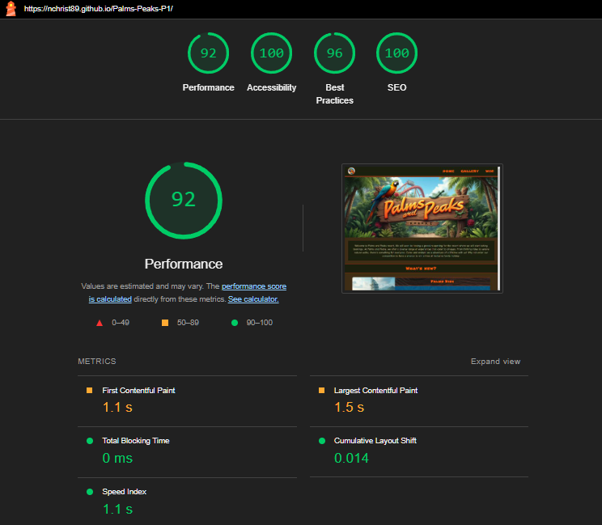

#### Gallery Page

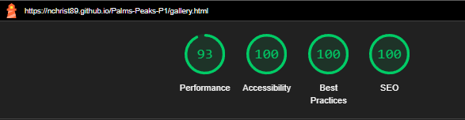

#### Win Page

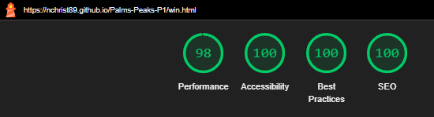

#### Success Page

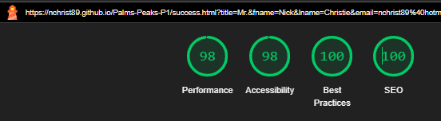

### Full Testing

To fully test my website I performed the following testing on a couple devices. Family and friends’ mobiles and different browsers on my own machine.

I also went through each page using Chrome Developer Tools to ensure that each page is responsive on all different screen sizes.

Links.

1. Tested each link on the index page. Each link worked as expected and any links leading to external pages opened correctly in a separate tab.
2. Tested each link on the gallery page. Each link worked as expected and any links leading to external pages opened correctly in a separate tab.
3. Tested each link on the gallery page. Each link worked as expected and any links leading to external pages opened correctly in a separate tab.
4. Tested each link on the win page. Each link worked as expected and any links leading to external pages opened correctly in a separate tab.
5. Tested each link on the success page. Each link worked as expected and any links leading to external pages opened correctly in a separate tab.

Competition Form.

1. Testing the competition form. I tried to submit the form without filling any input fields. The form worked correctly and directed users to fill in the empty title field which are radio buttons. I then filled this in and continued to the First Name field.
2. leaving all other fields empty, again it pointed out the First Name field was empty and needed to be input.
3. I then followed this onward through the form for each field and was successfully hit with the notification that the next field had not been input and could not be left empty.

Responsiveness.

1. I have assessed the responsiveness of the website from the very beginning of the development and tried to ensure that the entire website is responsive throughout the build.
2. I have evaluated using friends and families own devices and also sent the Github pages link to multiple friends and family to request them to test on their devices. I have had some issues on some devices, but most have been fine. Usually, it comes down to the breakpoints being slightly different on some devices. I have tried my best to make sure it looks fine without causing the layout to break on other devices while fixing the ones I have tried.

## Credits

### Code used

* [Create responsive Navbar and sidebar](https://www.youtube.com/watch?v=8eFeIFKAKHw)

* Some code has been autocompleted with the help of AI Copilot. This was turned off mid project as it was too helpful and I wanted to write more myself.
* I have had many helpful tips from watching Kevin Powell on YouTube.

### Content

Content for the website has solely been created by myself and with the assistance of ChatGPT, Sider (AI chrome extension).

### Media

#### Images

* Each image on the website has been created by providing AI with prompts to produce the desired image needed for my content. Prome AI has been used on the home page Although a few others used have been Microsoft Designer, fal.ai, aitubo.ai which if any will be shown on the Gallery page.

### Acknowledgements

I would like to acknowledge the following people who helped me along the way in completing my first milestone project:

* Jubril Akolade - My Code Institute mentor
* Code institute for providing the necessary tutoring support.
* My Tutor Rachel Furlong for all assistance provided throughout the journey providing assurance.
* Coding2go YouTube channel for help creating the navigation / sidebar combo.
* Kevin Powell for many helpful YouTube videos for CSS and HTML.
